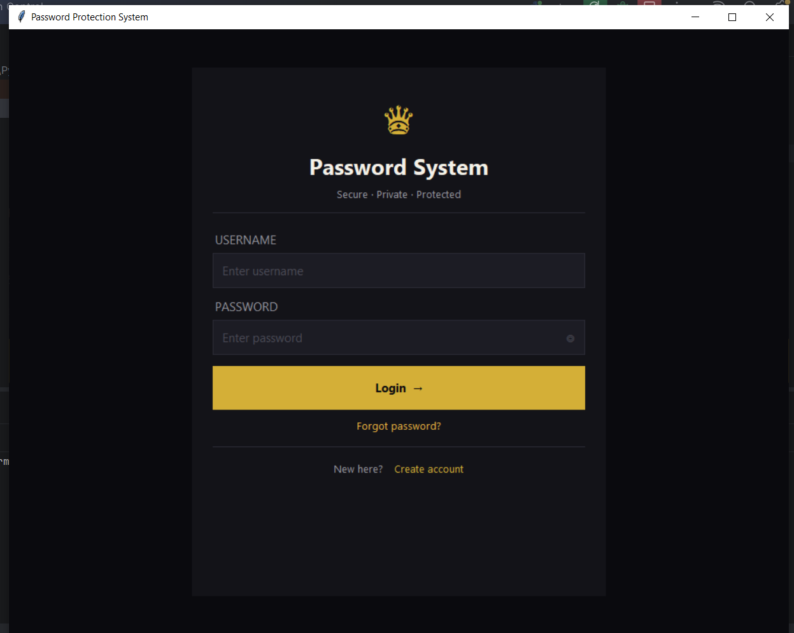
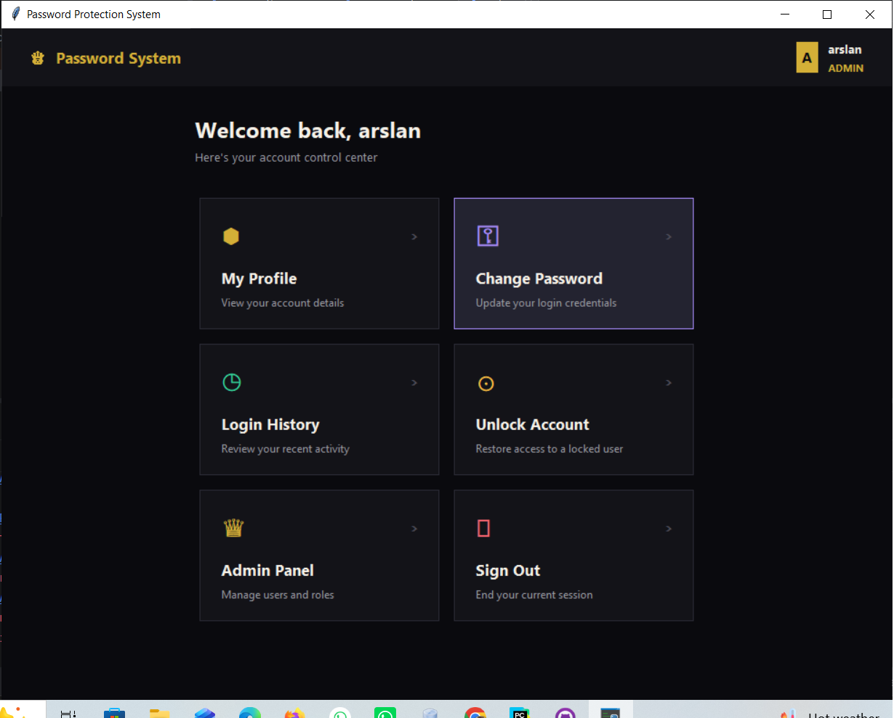
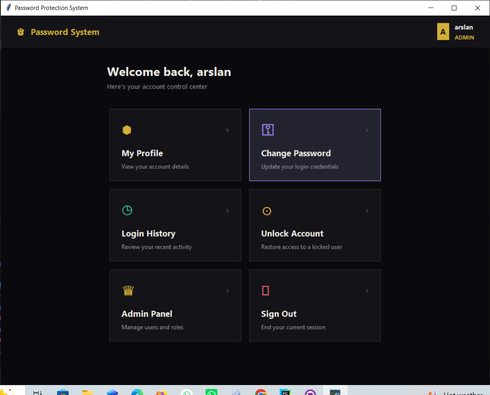

# 🔐 Password Protection System

A secure, full-featured password management and authentication system built with **Python**, **Oracle Database (XE)**, and **Tkinter**, featuring email-based OTP verification, salted password hashing, role-based access control, and a premium dark-themed GUI.


---

## 📸 Screenshots

<!--
Add your screenshots below. Save the image files inside a folder named
"screenshots" in your project, then reference them like this:



Recommended screenshots to include:
- Login screen
- OTP verification screen
- Dashboard (main menu)
- Register / Create Account screen
- Admin panel (if applicable)
-->

| Login | OTP Verification | Dashboard |
|:---:|:---:|:---:|
|  |  |  |

---

## ✨ Features

- **Secure Authentication** — SHA-256 password hashing with unique per-user salts
- **Two-Factor Login** — Email-based OTP (One-Time Password) verification via Gmail SMTP on every login
- **Account Lockout Protection** — Automatic account locking after repeated failed login attempts
- **Password Recovery** — Reset via security question or email OTP
- **Role-Based Access Control** — Admin, Moderator, and User roles with different permissions
- **Login History & Audit Logging** — Every login attempt (success/failure) is recorded with timestamp and IP
- **Password Expiry Alerts** — Warns users before their password expires
- **Session Auto-Logout** — Automatically logs out inactive users after a timeout period
- **Admin Panel** — Manage user roles and unlock locked accounts
- **Modern UI** — Custom-built dark, premium-themed interface using Tkinter

---

## 🛠️ Tech Stack

| Component | Technology |
|---|---|
| Language | Python 3.9 |
| Database | Oracle Database XE |
| GUI Framework | Tkinter |
| Password Hashing | SHA-256 with salting |
| Email/OTP Delivery | Gmail SMTP |
| Credential Management | Environment variables |

---

## 📁 Project Structure

```
password-protection-system/
│
├── gui.py              # Tkinter GUI — all screens (login, register, dashboard, admin, etc.)
├── password.py         # Core logic — hashing, OTP, database operations
├── connection.py        # Database connection setup
├── requirements.txt     # Python dependencies
├── .gitignore            # Files excluded from version control
└── README.md             # Project documentation
```

---

## ⚙️ Setup & Installation

1. **Clone the repository**
   ```bash
   git clone https://github.com/YOUR_USERNAME/password-protection-system.git
   cd password-protection-system
   ```

2. **Install dependencies**
   ```bash
   pip install -r requirements.txt
   ```

3. **Set up Oracle XE database**
   - Install Oracle Database XE
   - Create the required tables (users, passwords, roles, login_attempts)

4. **Configure credentials**
   - Set your database and email credentials as environment variables (or in your local config file — this file is intentionally excluded from the repository for security)

5. **Run the application**
   ```bash
   python gui.py
   ```

---

## 🔒 Security Notes

This project follows secure coding practices:
- No plaintext passwords are ever stored — all passwords are hashed with SHA-256 and a unique salt
- Database and email credentials are never hardcoded or committed to version control
- Sensitive configuration values must be supplied via environment variables at runtime

---

## 📄 License

This project is for educational and portfolio purposes.

---

## 👤 Author

**Arslan**
BS Software Engineering, The Islamia University of Bahawalpur
